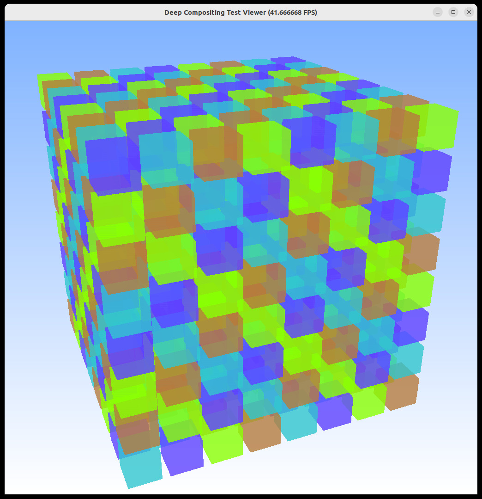

`deepComp`: A CUDA+MPI Library for fast Compositing of "deep" Z-and-alpha Frame Buffers

This library allows a data-parallel application to render, on each
individual rank, a "deep" frame buffer with multiple RGBA-z fragments
for each pixel, and to then rely on this library to properly z- and
alpha-composite all these inputs into a single image.

Some key benefits of this library's approach:

- deepComp is not limited to a single fragment per rank per pixel;
  each rank can already have multiple framgments for each pixel

- deepComp allows for both alpha- and z-compositing; it automatically
  sorts all each pixel's (RGBA-z) framgents by z, then performs proper
  front-to-back alpha-blending
  
- deepComp does not require a fixed compositing order of all ranks;
  composting happens on fragments, which ranks can generate in any order

- deepCOmp is not restricted to whole "frame buffers" on each rank;
  fragments can be written by any CUDA kernel, in any order.
  

Note:

- `deepComp` relies on a CUDA-aware MPI implementation that can properly
  understand device addresses.
  
Example:

- This here is a screenshot from the (included) testDeepViewer app, running with 4 MPI ranks:

    /home/wald/opt/bin/mpirun  -n 4 ./testDeepViewer
	
In this sample, each rank creates multiple different semi-transparent cubes; with the cude's
color encoding the rank it is on. `deepComp` will properly composite the resulting fragments,
even though several pixels have multiple ranks from different ranks, in often "interleaved" order.

